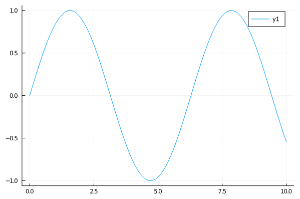

# Julia で機械学習

ダニエル(@daniel_program)

---

## みなさん Julia はご存知ですか？

---

## Julia とは


```julia
println("Hello World!")
```

- 書きやすい
- 速い(JIT)

---

## 書きやすい一例

```julia
julia> A = [1 2
            3 4]
2×2 Array{Int64,2}:
 1  2
 3  4

julia> A * A
2×2 Array{Int64,2}:
  7  10
 15  22

julia> A .* A
2×2 Array{Int64,2}:
 1   4
 9  16
```

---

## データの表示

```julia
julia> using Plots

julia> x = 0:0.1:10
0.0:0.1:10.0

julia> y = sin.(x) # .は全てに適用
101-element Array{Float64,1}:
  0.0
  0.09983341664682815
  0.19866933079506122
  0.29552020666133955
  ⋮
 -0.3664791292519284
 -0.4575358937753214
 -0.5440211108893698

julia> plot(x,y)
```



---

## 速い


[Julia Micro-Benchmarks](https://julialang.org/benchmarks/)

---

## Julia での機械学習はここが良い

- 簡単に記述できる(Pytorch 風)
- 自動微分が楽
- よりインタラクティブに分析できる

---


---

## 簡単に記述できる

モデルの作り方

```julia
julia> using Flux

julia> model = Chain(
           Dense(784, 128, relu),
           Dense(128, 10),
           logsoftmax,
        )
Chain(Dense(784, 128, relu), Dense(128, 10), logsoftmax)
```

---

## モデルの使い方

```julia
julia> model(rand(784,5)) # ランダムなデータを5つ入力
10×5 Array{Float32,2}:
 -2.0062   -3.1991   -3.16117  -3.63618  -2.62927
 -3.19613  -2.61039  -2.42026  -2.23364  -2.3462
 -2.49663  -1.99805  -2.24729  -2.23044  -2.43747
 -3.3243   -2.53268  -2.64656  -2.75284  -2.51889
  ⋮
 -2.40612  -2.15469  -2.11569  -2.35603  -2.74064
 -2.17706  -2.36897  -2.75496  -2.08347  -2.19851
 -3.70686  -3.23972  -3.1855   -3.24699  -2.74348
```

学習については Pytorch と似たような記述方法になっています。

---

## 自動微分

```julia
julia> f(x) = 2x + 1 # 関数定義
f (generic function with 1 method)
julia> f(2)
5
julia> f'(2) # f(x)を微分して2を代入して計算, f'(x) = 2
2
julia> @code_llvm f'(2) # LLVMの表現を見る
define i64 @"julia_#43_13375"(i64) {
top:
  ret i64 2
}
```

多変数関数のためにはより汎用な`gradient`関数が用意されています。

<!-- LLVMの部分はコメント部分を省略しています -->

---

## 自分のレイヤーを定義

Flux では自分のレイヤーを作ることはとても簡単です。

```julia
struct MyDense # レイヤーの構造体定義
    W # 重み
    B # バイアス
end

# 入出力の個数から初期化できるようにする
MyDense(input::Integer, output::Integer) =
    MyDense(randn(output, input), randn(output))

# レイヤーの動作の定義
(m::MyDense)(x) = m.W * x .+ m.B

Flux.@functor MyDense # パラメータを学習可能にする
```

これだけの定義で Flux のモデルに組み込めます。

---

## インタラクティブ

[Pluto.jl][]

---

## 使用されているところ

[DifferentialEquations.jl][]: 微分方程式を解ける

---

## 書きやすくするライブラリ

[Plots.jl][]: グラフの描写
[PyCall.jl][]: Python の読み込み
[DataFrames.jl][]: Pandas のようにデータを格納できる
[CUDA.jl][]: GPU を使える

[plots.jl]: https://github.com/JuliaPlots/Plots.jl
[pycall.jl]: https://github.com/JuliaPy/PyCall.jl
[dataframes.jl]: https://github.com/JuliaData/DataFrames.jl
[differentialequations.jl]: https://github.com/SciML/DifferentialEquations.jl
[cuda.jl]: https://github.com/JuliaGPU/CUDA.jl
[flux.jl]: https://github.com/FluxML/Flux.jl
[pluto.jl]: https://github.com/fonsp/Pluto.jl
